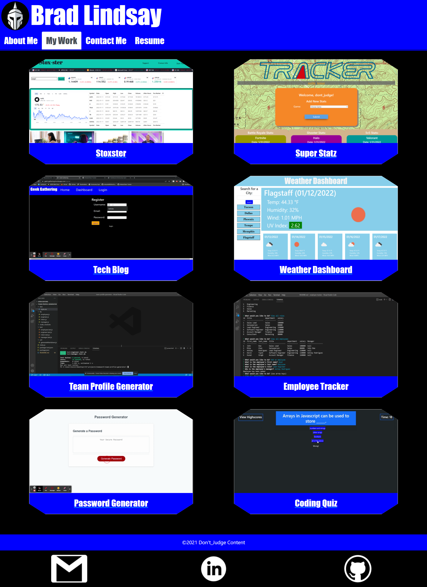

# Brad Lindsay Professional Portfolio
  

## Description

This is my professional portfolio, created using react. Here, you can find the projects that I am most proud of, as well as a resume of my history and contact information if anyone would like to reach out to me regarding opportunities for projects. Please enjoy.

## Table of Contents
* [Usage](#usage)
* [License](#license)
* [Questions](#questions)
   

## Usage

https://bslindsa.github.io/blindsay-portfolio/

## License

This project is licensed under the MIT license.
https://opensource.org/licenses/MIT

## Questions

Github Username: bslindsa 

Email: bslindsa@gmail.com

